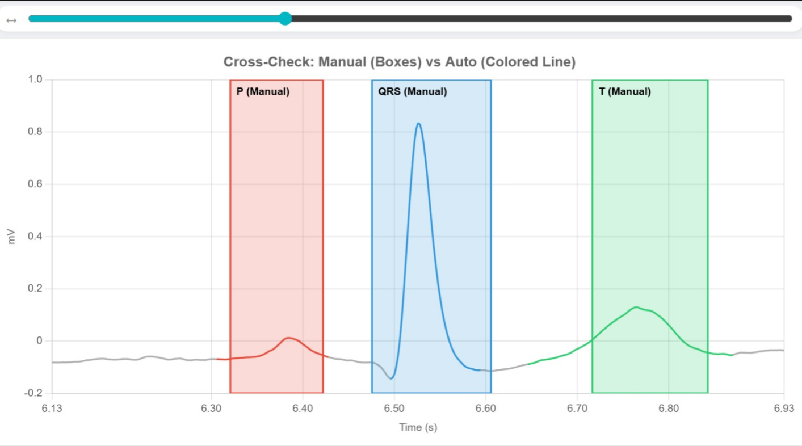

  <h2 style="margin-bottom: 10px;"> Procedure </h2>

  

    <b>1. Signal Acquisition</b> 
    Select a dataset (<b>ECG 1</b>, <b>ECG 2</b>, or <b>ECG 3</b>) from the <b>Input Panel</b> and click <b>Load Raw Signal</b>.
    The raw (noisy) signal will appear in the top graph in <b>red</b>.
  

  

    <b>2. Pre-processing</b> 
    Click <b>Filter Signal</b>. This applies a <b>Butterworth filter</b> to remove baseline wander and high-frequency noise.
    The clean signal (<b>blue</b>) will appear below the raw signal.
  

  

    <b>3. Signal Analysis</b> 
    Choose one of the two methods below to identify wave components:
  

  

    <b>A. Auto Analysis (Algorithmic)</b> 
    Click <b>Start Auto Analysis</b>. The system will automatically:
  

  <ul style="margin-top: 5px; margin-bottom: 10px;">
    <li>Detect <b>R-peaks</b> with high precision.</li>
    <li>Highlight <b>P-wave (Red)</b>, <b>QRS complex (Blue)</b>, and <b>T-wave (Green)</b> boundaries.</li>
    <li>Calculate <b>Heart Rate</b>, <b>QRS Duration</b>, and <b>R-R Intervals</b> in the <b>Results Panel</b>.</li>
  </ul>

  

    <b>B. Manual Labelling (Interactive)</b> 
    

    Click <b>Start Labelling</b>. You must click the graph <b>6 times</b> in this exact order:
  

  <ul style="margin-top: 5px; margin-bottom: 10px;">
    <li><b>P-Wave Onset</b> (Start)</li>
    <li><b>P-Wave Offset</b> (End)</li>
    <li><b>QRS Onset</b> (Start)</li>
    <li><b>QRS Offset</b> (End)</li>
    <li><b>T-Wave Onset</b> (Start)</li>
    <li><b>T-Wave Offset</b> (End)</li>
  </ul>

  

    Once finished, a <b>Cross-Check</b> button will appear. Click it to compare your manual marks against the algorithm's detection.
  

  

   For the above manual labelling, refer to below image:
 

    
  

  

    <b>4. Navigation & Details</b> 
    <b>Snap-to-Beat:</b> Use the scrollbar to jump between individual heartbeats (Beat 1, Beat 2, etc.). 
    <b>Hover:</b> Move your mouse over any colored wave component or background segment to see its medical description and duration.
  

  

    <b>5. Reset</b> 
    Click <b>Reset</b> to clear all data and start a new experiment.
  

