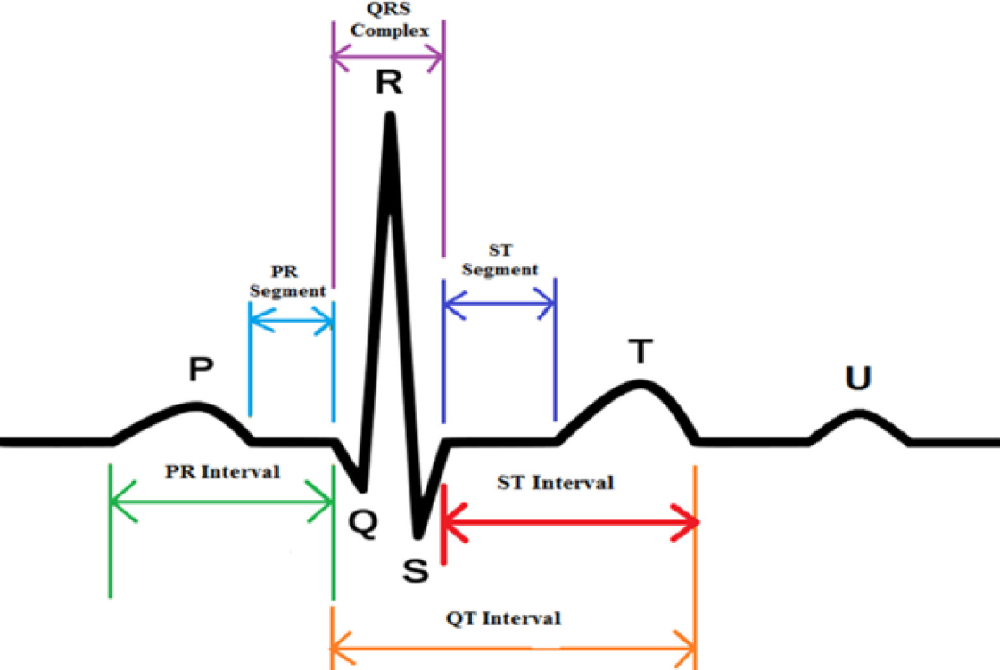

    
  
  <!-- ===================== MAIN HEADING (H1) ===================== -->
  <h4 style="font-size: 34px; font-weight: bold; margin-bottom: 10px;">
    Introduction
  </h4>

  

    The <b>Electrocardiogram (ECG)</b> is a <b>non-invasive biomedical signal</b> that records the electrical activity of the heart over time. It is obtained by placing electrodes on the body surface, which capture voltage changes produced during cardiac <b>depolarization</b> and <b>repolarization</b>. The ECG waveform consists of characteristic components such as the <b>P wave</b>, <b>QRS complex</b>, and <b>T wave</b>, each corresponding to specific electrical events within the heart. A clean and properly recorded ECG signal plays an important role in the clinical analysis and diagnosis of cardiac conditions, as it provides critical information related to heart rhythm, conduction pathways, and overall cardiac function.
  

  <!-- ===================== MAIN HEADING (H1) ===================== -->
  <h4 style="font-size: 34px; font-weight: bold; margin-top: 25px; margin-bottom: 10px;">
    Purpose of Identifying Individual ECG Wave Components
  </h4>

  

    Each component of the ECG waveform (<b>P</b>, <b>Q</b>, <b>R</b>, <b>S</b>, and <b>T</b>) corresponds to a specific <b>physiological event</b> occurring during the cardiac cycle. Correct identification of these wave components is essential because it helps in understanding how the electrical impulse travels through different regions of the heart and whether the heart is functioning normally.
  

  <ul>
    <li><b>P wave:</b> Represents <b>atrial depolarization</b>, which is the electrical activation of the upper chambers of the heart (<b>atria</b>).</li>
    <li><b>QRS complex:</b> Represents <b>ventricular depolarization</b>, which is the electrical activation of the lower chambers (<b>ventricles</b>). It is the most prominent part of the ECG due to its high amplitude and rapid slope.</li>
    <li><b>T wave:</b> Represents <b>ventricular repolarization</b>, which is the recovery phase of the ventricles after contraction and pumping of blood.</li>
  </ul>

   
  

    
  

   
  

    <b>Figure-1: Components of ECG</b>
  

   

  

    Identifying and measuring these components helps clinicians determine whether the heart rhythm and conduction system are normal or if any <b>abnormalities</b> are present. For example, the <b>duration of the QRS complex</b> and the <b>time intervals between waves</b> can indicate <b>conduction delays</b> or possible <b>ischemic damage</b>. A prolonged or widened QRS complex may suggest that the electrical signal is moving slowly inside the heart, while changes in the timing and spacing between waves can reflect underlying heart-related disorders that require further medical evaluation.
  

  <!-- ===================== MAIN HEADING (H1) ===================== -->
  <h4 style="font-size: 34px; font-weight: bold; margin-top: 25px; margin-bottom: 10px;">
    ECG Leads and Selection of Lead II
  </h4>

  

    This study focuses on identifying key ECG wave components using <b>Lead II</b> of the standard <b>12-lead ECG configuration</b>. Lead II is widely used because it aligns closely with the heart’s <b>electrical axis</b>, making the <b>P wave</b> and <b>QRS complex</b> more prominent and easier to detect than in many other leads. Analysis of Lead II provides clear and reliable measurements for waveform <b>timing</b> and <b>amplitude</b>, making it highly suitable for rhythm interpretation and component identification.
  

  <!-- ===================== SUB-HEADING (H2) ===================== -->
  <h4 style="font-size: 28px; font-weight: bold; margin-top: 20px; margin-bottom: 10px;">
    Standard Limb Leads (I, II, III)
  </h4>

  

    The standard ECG system uses three <b>bipolar limb leads</b>—<b>Lead I</b>, <b>Lead II</b>, and <b>Lead III</b>—to record the heart’s electrical activity in the <b>frontal plane</b>. These leads are formed by placing electrodes on the <b>right arm (RA)</b>, <b>left arm (LA)</b>, and <b>left leg (LL)</b>.
  

  <ul>
    <li><b>Lead I:</b> Measures the voltage difference between <b>LA (+)</b> and <b>RA (−)</b>.</li>
    <li><b>Lead II:</b> Measures the voltage difference between <b>LL (+)</b> and <b>RA (−)</b>.</li>
    <li><b>Lead III:</b> Measures the voltage difference between <b>LL (+)</b> and <b>LA (−)</b>.</li>
  </ul>

  

    Each lead records the same cardiac electrical activity but from a different angle, producing different waveform shapes and amplitudes. A fundamental principle derived from this configuration is <b>Einthoven’s Law</b>, which states:
  

  

    <b>Lead II = Lead I + Lead III</b>
  

  <!-- ===================== MAIN HEADING (H1) ===================== -->
  <h4 style="font-size: 34px; font-weight: bold; margin-top: 30px; margin-bottom: 10px;">
    Standard ECG Waveform Components
  </h4>

  <!-- ===================== SUB-HEADING (H2) ===================== -->
  <h4 style="font-size: 28px; font-weight: bold; margin-top: 15px;">
    Table 1: P Wave Characteristics (Lead II ECG)
  </h4>

  <table border="1" cellpadding="10" cellspacing="0" style="border-collapse: collapse; width: 100%; margin-bottom: 25px;">
    <tr>
      <th>Parameter</th>
      <th>Details</th>
    </tr>
    <tr>
      <td><b>Physiological Significance</b></td>
      <td>Represents <b>atrial depolarization</b> (electrical activation of atria), starting from the <b>SA node</b> and spreading through both atria.</td>
    </tr>
    <tr>
      <td><b>Normal Duration</b></td>
      <td><b>&lt; 120 ms (0.12 s)</b> in adults</td>
    </tr>
    <tr>
      <td><b>Normal Amplitude (Lead II / Limb Leads)</b></td>
      <td>Normal upper limit <b>&lt; 0.25 mV (2.5 mm)</b> in limb leads (<b>Lead II</b> is commonly used for P-wave assessment).</td>
    </tr>
    <tr>
      <td><b>Clinical Importance</b></td>
      <td>
        • <b>Increased P-wave duration</b> may indicate <b>delayed atrial conduction</b> (atrial enlargement / conduction disease). 
        • High P-wave amplitude in Lead II (<b>&gt; 0.25–0.30 mV</b>) may indicate <b>Right Atrial Enlargement</b> (<b>P pulmonale</b>).
      </td>
    </tr>
  </table>

  <!-- ===================== SUB-HEADING (H2) ===================== -->
  <h4 style="font-size: 28px; font-weight: bold; margin-top: 15px;">
    Table 2: QRS Wave Characteristics (Lead II ECG)
  </h4>

  <table border="1" cellpadding="10" cellspacing="0" style="border-collapse: collapse; width: 100%; margin-bottom: 25px;">
    <tr>
      <th>Parameter</th>
      <th>Details</th>
    </tr>
    <tr>
      <td><b>Physiological Significance</b></td>
      <td>Represents <b>rapid ventricular depolarization</b>, as the electrical impulse travels through the <b>His–Purkinje system</b> and activates the ventricular muscle.</td>
    </tr>
    <tr>
      <td><b>Normal QRS Duration</b></td>
      <td>
        Measured from the <b>start of Q</b> (or <b>R if Q is absent</b>) to the <b>end of S</b>. 
        Normal duration: <b>60–100 ms</b>, and clinically normal if <b>&lt; 120 ms</b>.
      </td>
    </tr>
    <tr>
      <td><b>Normal QRS Amplitude (Lead II)</b></td>
      <td>
        Varies among individuals due to body structure and electrode placement. 
        In Lead II, the <b>R wave is usually prominent</b> (often around <b>~1 mV</b> in many normal ECGs),
        making Lead II useful for teaching and detection.
      </td>
    </tr>
    <tr>
      <td><b>Clinical Importance</b></td>
      <td>
        • <b>Wide QRS (≥ 120 ms)</b> suggests <b>ventricular conduction delay</b> (e.g., bundle branch block) or ventricular-origin beats. 
        • <b>Very low QRS voltage in limb leads (&lt; 0.5 mV)</b> can be clinically significant (e.g., pericardial effusion, obesity, COPD). 
        • QRS duration and shape standards are defined in professional guidelines.
      </td>
    </tr>
  </table>

  <!-- ===================== SUB-HEADING (H2) ===================== -->
  <h4 style="font-size: 28px; font-weight: bold; margin-top: 15px;">
    Table 3: T Wave Characteristics (Lead II ECG)
  </h4>

  <table border="1" cellpadding="10" cellspacing="0" style="border-collapse: collapse; width: 100%; margin-bottom: 25px;">
    <tr>
      <th>Parameter</th>
      <th>Details</th>
    </tr>
    <tr>
      <td><b>Ventricular Repolarization</b></td>
      <td>The <b>T wave</b> represents <b>ventricular repolarization</b>, which is the electrical recovery of the ventricles after contraction.</td>
    </tr>
    <tr>
      <td><b>Normal Amplitude (and note on duration)</b></td>
      <td>
        T wave amplitude is usually <b>&lt; 5 mm (0.5 mV)</b> in limb leads. 
        T-wave duration is not always measured separately; it is commonly evaluated as part of the <b>QT interval</b>, and clinical guidelines mainly focus on <b>ST–T shape (morphology)</b> and QT measurement standards.
      </td>
    </tr>
    <tr>
      <td><b>Polarity in Lead II</b></td>
      <td>In a normal ECG, the <b>T wave is typically upright (positive)</b> in <b>Lead II</b>.</td>
    </tr>
  </table>

  <!-- ===================== SUB-HEADING (H2) ===================== -->
  <h4 style="font-size: 28px; font-weight: bold; margin-top: 15px;">
    Table 4: PQ (PR) Segment Characteristics (Lead II ECG)
  </h4>

  <table border="1" cellpadding="10" cellspacing="0" style="border-collapse: collapse; width: 100%; margin-bottom: 25px;">
    <tr>
      <th>Parameter</th>
      <th>Details</th>
    </tr>
    <tr>
      <td><b>Definition and Location</b></td>
      <td>
        The <b>PQ (PR) segment</b> is the flat (<b>isoelectric</b>) part of the ECG that starts at the <b>end of the P wave</b> and ends at the <b>beginning of the QRS complex</b>.
        It lies between <b>atrial depolarization</b> and <b>ventricular depolarization</b>.  
        <b>Note:</b> 
        • <b>PR interval = P wave + PQ segment</b> 
        • <b>PQ segment = only the flat baseline portion</b>
      </td>
    </tr>
    <tr>
      <td><b>Electrical Activity Represented</b></td>
      <td>
        Represents: 
        • Impulse conduction through the <b>AV node</b> 
        • Conduction through the <b>His bundle</b> and <b>bundle branches</b> 
        • A normal delay that allows ventricles to fill before contraction
      </td>
    </tr>
    <tr>
      <td><b>Reason for Flat Line</b></td>
      <td>Since <b>AV nodal conduction is slow</b> and produces very small electrical signals, it appears as a <b>flat line</b> on the ECG.</td>
    </tr>
  </table>

  <!-- ===================== SUB-HEADING (H2) ===================== -->
  <h4 style="font-size: 28px; font-weight: bold; margin-top: 15px;">
    Table 5: ST Segment Characteristics (Lead II ECG)
  </h4>

  <table border="1" cellpadding="10" cellspacing="0" style="border-collapse: collapse; width: 100%; margin-bottom: 25px;">
    <tr>
      <th>Parameter</th>
      <th>Details</th>
    </tr>
    <tr>
      <td><b>Definition and Baseline Reference</b></td>
      <td>
        The <b>ST segment</b> starts from the <b>end of the QRS complex (J point)</b> and ends at the <b>beginning of the T wave</b>.
        It represents the time between <b>ventricular depolarization</b> and <b>ventricular repolarization</b>.
        The ST segment is measured using the <b>isoelectric baseline</b>, which is commonly taken from the <b>PQ segment</b>
        because it shows the most stable baseline (electrical neutrality).
      </td>
    </tr>
    <tr>
      <td><b>Normal Characteristics in Lead II</b></td>
      <td>
        In a normal ECG, the <b>ST segment is flat (isoelectric)</b> in Lead II.
        Small variations up to <b>±0.5 mm</b> may be considered normal depending on age and body physiology.
        Lead II is often used for ST baseline comparison because its waveform is usually <b>clear and stable</b>.
      </td>
    </tr>
    <tr>
      <td><b>Physiological Meaning</b></td>
      <td>
        The flat ST segment represents the <b>plateau phase (Phase 2)</b> of the ventricular action potential.
        During this phase, there is <b>no major net electrical current</b> detected on the body surface,
        so the line appears flat.
      </td>
    </tr>
  </table>

   

  <!-- ===================== MAIN HEADING (H1) ===================== -->
  <h4 style="font-size: 34px; font-weight: bold; margin-top: 25px; margin-bottom: 10px;">
    Detection of Different ECG Waveforms & Segments
  </h4>
   
  <!-- ===================== SUB-HEADING (H2) ===================== -->
  <h4 style="font-size: 28px; font-weight: bold; margin-top: 15px; margin-bottom: 10px;">
    1. QRS Complex Detection Using the Pan–Tompkins Algorithm
  </h4>

  

    The Pan–Tompkins method is a classical real-time QRS detection algorithm designed to emphasize the
    high-frequency and high-slope characteristics of the QRS complex while suppressing baseline drift,
    muscle noise, and low-slope components such as P and T waves. The algorithm employs a sequential
    processing chain.
  

  <!-- ===================== SUB-SUB HEADING (H3) ===================== -->
  <h4 style="margin-left: 2%; font-size: 22px; font-weight: bold;">a. Band-pass filtering</h4>
  

    Band-pass filtering is applied to suppress baseline wander and high-frequency noise while retaining
    the frequency band in which the QRS complex has dominant energy. This improves the signal-to-noise
    ratio and enhances QRS visibility in subsequent stages.
  

  <h4 style="margin-left: 2%; font-size: 22px; font-weight: bold;">b. Differentiation</h4>
  

    A derivative operator is applied to highlight rapid changes in the ECG waveform. Since the QRS
    complex exhibits the steepest slopes in the ECG, the differentiation stage increases the prominence
    of QRS components relative to slower waves.
  

  <h4 style="margin-left: 2%; font-size: 22px; font-weight: bold;">c. Squaring</h4>
  

    The differentiated signal is squared, making all values positive and amplifying larger slope
    magnitudes more than smaller ones. This operation strengthens QRS-related transitions and reduces
    the relative influence of lower-amplitude components.
  

  <h4 style="margin-left: 2%; font-size: 22px; font-weight: bold;">d. Moving window integration</h4>
  

    A moving window integrator is used to produce a smoother energy envelope that reflects both the
    intensity and duration of the QRS complex. A window length on the order of approximately 150 ms is
    typically used to match physiological QRS width.
  

  <h4 style="margin-left: 2%; font-size: 22px; font-weight: bold;">e. Adaptive thresholding and decision logic</h4>
  

    Peak detection is performed on the integrated signal using an adaptive threshold. The threshold is
    continuously updated based on noise and signal peak levels to maintain stability under varying ECG
    amplitudes and noise conditions. Peaks exceeding the threshold are classified as candidate QRS
    complexes. The precise R-peak location is then refined using the corresponding maximum in the
    filtered ECG signal within a narrow search region. The final output of this stage consists of accurately detected R-peaks, which serve as reference
    landmarks for identifying all remaining waveform components.
  

  

    
  

   
  

    <b>Figure-2: QRS Detection Output</b>
  

  <!-- ===================== SUB-HEADING (H2) ===================== -->
  <h4 style="font-size: 28px; font-weight: bold; margin-top: 25px; margin-bottom: 10px;">
    2. P Wave Detection
  </h4>

  

    The P wave represents atrial depolarization and typically occurs before each QRS complex. After obtaining
    R-peak locations, P wave detection can be performed using a time-constrained search strategy.
  

  <!-- ===================== SUB-SUB HEADING (H3) ===================== -->
  <h4 style="margin-left: 2%; font-size: 22px; font-weight: bold;">a. Search region definition</h4>
  

    For each detected R-peak, a backward search window is defined in the range of approximately 120 to 200 ms
    before the R-peak. This window corresponds to the expected physiological position of the P wave in normal rhythm.
  

  <h4 style="margin-left: 2%; font-size: 22px; font-weight: bold;">b. Peak identification</h4>
  

    Within the defined window, the most prominent deflection is identified as the P wave peak. A minimum amplitude
    criterion is often applied to reduce the probability of selecting noise fluctuations. Further refinement may be
    performed by smoothing the local segment to improve stability in low-amplitude signals. The output of this stage includes P wave peak time and amplitude, along with the estimated P wave onset and offset
    when delineation is required.
  

  <!-- ===================== SUB-HEADING (H2) ===================== -->
  <h4 style="font-size: 28px; font-weight: bold; margin-top: 25px; margin-bottom: 10px;">
    3. T Wave Detection
  </h4>

  

    The T wave represents ventricular repolarization and follows the QRS complex. Because it has lower slope than QRS
    but higher amplitude than the P wave in many recordings, it is typically detected reliably using a forward search
    window after R-peak localization.
  

  <h4 style="margin-left: 2%; font-size: 22px; font-weight: bold;">a. Search region definition</h4>
  

    For each R-peak, a forward window is defined approximately 200 to 400 ms after the R-peak, covering the expected
    position of the T wave peak in normal conduction.
  

  <h4 style="margin-left: 2%; font-size: 22px; font-weight: bold;">b. Peak identification</h4>
  

    Within the forward window, the dominant repolarization deflection is identified as the T wave peak. Since the T
    wave is broader than QRS, moderate smoothing improves robustness and reduces sensitivity to high-frequency noise.
    The output includes the T wave peak time and amplitude and may be extended to determine T onset and T end when
    interval measurement is required.
  

  <!-- ===================== SUB-HEADING (H2) ===================== -->
  <h4 style="font-size: 28px; font-weight: bold; margin-top: 25px; margin-bottom: 10px;">
    4. PQ Segment Delineation
  </h4>

  

    The PQ segment, also referred to as the PR segment, is a clinically important portion of the ECG that extends from the
    end of the P wave to the onset of the QRS complex. It represents the period during which the electrical impulse travels
    through the atrioventricular node and the His–Purkinje conduction system before ventricular depolarization begins.
    In waveform terms, the PQ segment is typically isoelectric and is therefore commonly used as a reference baseline for
    segment-level measurements such as ST deviation assessment.
  

  <h4 style="margin-left: 2%; font-size: 22px; font-weight: bold;">a. PQ segment boundary estimation</h4>
  

    Accurate delineation of the PQ segment requires identification of two key fiducial points: the end of the P wave and
    the onset of the QRS complex. Following R-peak detection, the P wave is localized within a physiological window before
    the QRS complex. The P wave offset is estimated as the point where the atrial depolarization waveform returns to the
    baseline after the P peak. The onset of the QRS complex is identified as the earliest significant deviation from the
    baseline preceding the R peak, typically associated with the Q-wave initiation or the beginning of the rapid upstroke
    of the QRS complex.
  

  <h4 style="margin-left: 2%; font-size: 22px; font-weight: bold;">b. PQ segment measurement</h4>
  

    Once the P wave offset and QRS onset are determined, the PQ segment is defined as the interval between these points.
    The duration of the PQ segment is computed as the time difference between P offset and QRS onset. In addition to its
    timing, the mean amplitude of the PQ segment may be calculated to establish an isoelectric baseline reference, which is
    particularly useful for detecting deviations in the ST segment.
  

  <!-- ===================== SUB-HEADING (H2) ===================== -->
  <h4 style="font-size: 28px; font-weight: bold; margin-top: 25px; margin-bottom: 10px;">
    5. ST Segment Delineation
  </h4>

  

    The ST segment is a clinically significant portion of the ECG that begins at the end of ventricular depolarization
    and extends to the onset of ventricular repolarization. In waveform terms, the ST segment spans from the J point,
    located at the termination of the QRS complex, to the beginning of the T wave. Accurate ST segment delineation is
    essential for assessing ischemic changes, including ST elevation and ST depression, relative to the isoelectric baseline.
  

  <h4 style="margin-left: 2%; font-size: 22px; font-weight: bold;">a. J point estimation</h4>
  

    The J point occurs near the end of the QRS complex and represents the transition from ventricular depolarization to
    the early phase of repolarization. After locating the R-peak, the S-wave is identified as the negative deflection
    following the R peak in Lead II. The endpoint of the QRS complex can then be estimated based on the return of the
    ECG waveform toward the baseline, or by detecting a reduction in signal slope and energy following the S-wave.
    This estimated termination point is used as the J point for subsequent ST analysis.
  

  <h4 style="margin-left: 2%; font-size: 22px; font-weight: bold;">b. ST level and baseline reference</h4>
  

    ST deviation is assessed by comparing the ST level to an isoelectric baseline. The baseline is commonly taken from
    the PR segment, as it typically represents electrical neutrality. A representative ST level is often measured at a
    fixed offset after the J point, such as 60 ms to 80 ms, to reduce sensitivity to minor fluctuations immediately at
    the QRS termination.
  

  <h4 style="margin-left: 2%; font-size: 22px; font-weight: bold;">c. T wave onset estimation</h4>
  

    The onset of the T wave marks the end of the ST segment. It is estimated as the point where the ECG trace begins its
    gradual rise or fall toward the T wave peak. This transition can be detected using slope-based criteria, where a
    sustained change in the derivative indicates the start of repolarization. Baseline-crossing rules and local smoothing
    are also commonly applied to improve robustness in the presence of noise.
  

  <h4 style="margin-left: 2%; font-size: 22px; font-weight: bold;">d. ST segment measurement</h4>
  

    Once the J point and T wave onset have been identified, the ST segment duration is calculated as the time difference
    between these two fiducial points. The ST segment amplitude is quantified by measuring the voltage displacement of the
    ST level relative to the baseline. The resulting parameters include ST segment timing, ST level, and ST deviation values,
    which collectively support clinical interpretation and automated diagnostic screening.
  

